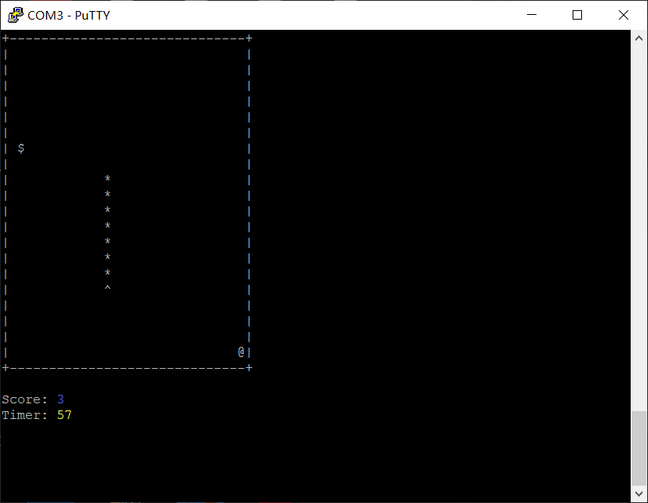

# Snake | 贪吃蛇 #

> 原作者：https://github.com/cyphar/ascii-snake

在ENV工具的配置方法：

```
 RT-Thread online packages  --->
    miscellaneous packages  --->
        games: games run on RT-Thread console  --->
            [*] snake: a remake of the old Nokia game
```

在终端下键入：

```shell
msh> snake
```

即可运行。



使用WASD或方向键控制，按Q退出。


## 维护&联系

Meco Man

jiantingman@foxmail.com

https://github.com/mysterywolf/2048
